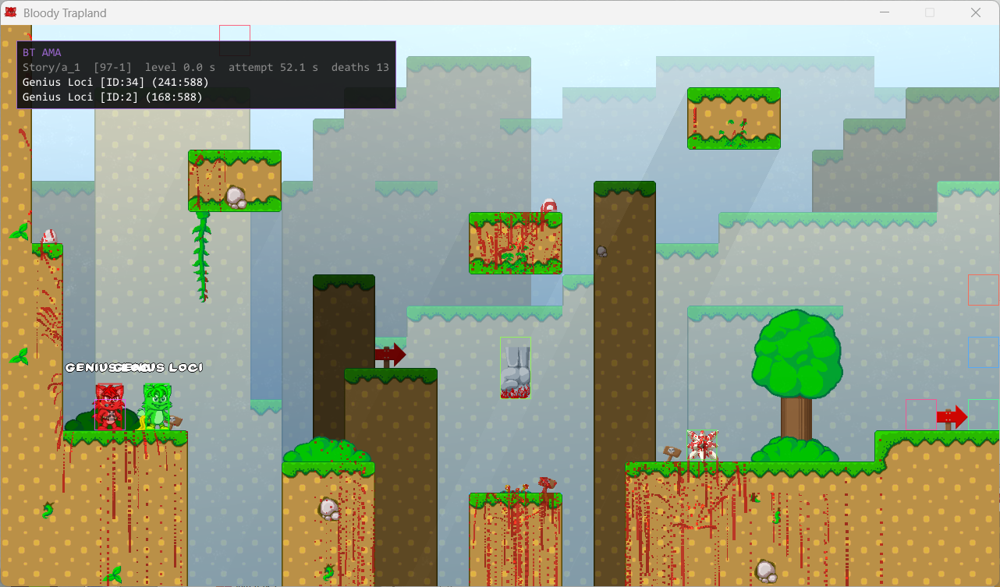
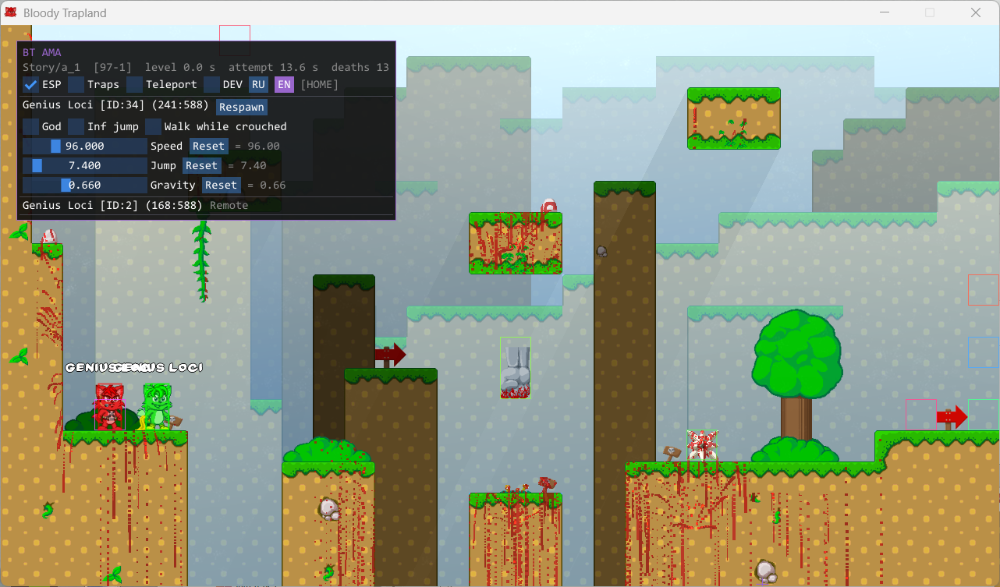
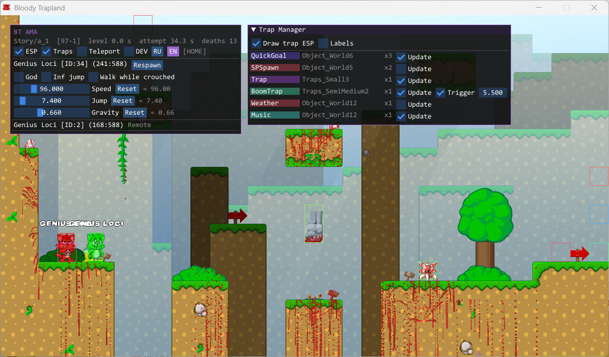
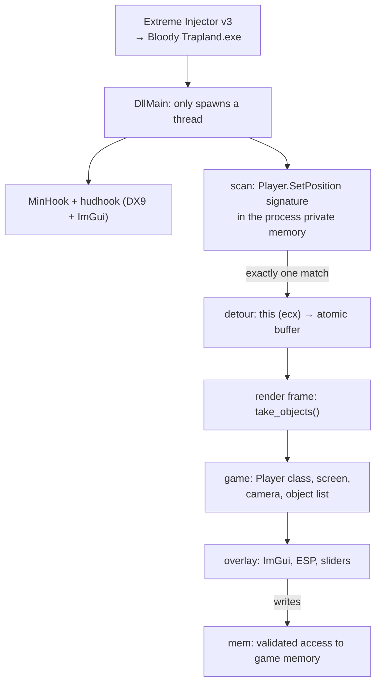

# BTama

[Русский](README.md) · **English**

An in-game overlay for **Bloody Trapland** (XNA / .NET Framework, 32-bit
process). It builds as a DLL, gets injected into the game process, hooks
`Player.SetPosition` to obtain pointers to live objects, and draws an ImGui
interface on top of the game through DirectX 9.

The project exists for the sake of digging into the game's internals: field
offsets were lifted by hand in Cheat Engine, and the interface is a way to
check them without rebuilding the DLL for every guess. Editing shared objects
in a network game diverges from the other player's state, so as intended this
is a single-player tool.

## Screenshots

### Collapsed menu: level summary and ESP



While the menu is closed, only the status line stays on screen — map, level
number, level and attempt timers, death count — along with the player list and
coordinates. ESP keeps working: trap boxes are colored by object address, the
local player is outlined green, a remote one red.

### Player menu



`HOME` pins the menu and reveals the toolbar: `ESP`, `Traps`, `Teleport`,
`DEV`, and the `RU`/`EN` switch. Below it is the local player row with a
respawn button, checkboxes for god mode, infinite jump and walking while
crouched, plus sliders for speed, jump height and gravity. Each slider carries
a reset button and the live value read back from the game.

### Trap Manager



Level objects are grouped by class: type from `ObjectType`, asset name, count
and shared flags. An action applies to the whole group — objects of one class
share both their fields and their meaning. `BoomTrap` additionally exposes
`Trigger` and `Speed`.

## Features

**ESP.** World-space boxes for traps and players, projected through the game's
own camera matrix. A trap box color is a stable hash of its address, the same
one used behind its name in the list, so it is obvious which box belongs to
which row. `Labels` answer the "what is this empty square" question — spawns,
goals and zones have no sprite but do have a type.

**Level summary.** Map (`MaptoLoad`), world and level number, time since level
start (`m_GameTimer`), time since last spawn (`m_FinishTimer`), deaths, kills.
It stays visible with the menu collapsed — that is the whole reason the
collapsed state exists. Fields that failed to read show a dash, not a zero.

**Player stats.** God mode, infinite jump, walking while crouched, sliders for
speed, jump height and gravity, and a respawn button. A slider takes effect
from the first drag and is written every frame — otherwise the game restores
its own value on the next respawn. The reset button restores the value as it
was when the character was first seen.

**Teleport.** Right-click outside the interface windows and the character
moves to the cursor. Screen coordinates are converted back to world space
through the inverse camera matrix.

**Trap Manager.** Every object of the current screen, grouped by method table
pointer. The `Update` flag (`Updateable`) shows the state of the group's first
object and writes to all of them; if the objects have diverged, an asterisk is
appended to the label — a click then aligns the group instead of toggling it.

Numeric class parameters whose offsets are known:

| Class | Slider | Field |
|---|---|---|
| `Spinner` | Rotation | `PendelSpeed` (0x9C), radians per second, 6.0 by default |
| `SawBlade` | Travel | `Movespeed` (0xA4); `RotationSpeed` (0xA0) follows in the same ratio |
| `Cannon` | Reload | `fireDelayMaxTime` (0xA0), seconds between shots |
| `Tracker` | Aim | `LockTimeWait` (0xAC) — how long it aims before firing |
| `RPlatform` | Travel | `Movespeed` (0x98) |
| `Threadmill` | Belt | `velocity.X` (0x9C) — what the belt adds to player speed |
| `Fan` | Airflow | `FanForce` (0x98) — strength and reach of the stream |
| `Trampoline` | Bounce | `BounceSpeed` (0x9C) |
| `BoomTrap` | Speed, Trigger | `Speed` (0xA4), `m_CanTrigger` (0xAC) |

**`DEV` mode.** Log path, parser counters (objects from the hook, the `Player`
method table, screen address, game mode, camera, trap count), raw object
fields past the shared part of the layout (0x90…0x140) and trap rectangle
numbers. Useful when hunting offsets, noise while playing.

**Two languages.** `RU` / `EN` switch in place. Game field names are not
translated in either: `Bounding`, `Updateable` and `moveSpeed` are named that
way in its sources, and translating them would cut the link to them.

## Controls

| Key | Action |
|---|---|
| `HOME` | pin or hide the menu |
| `TAB` | show the menu while held |
| `RMB` | teleport to the cursor (when the checkbox is on) |
| `PAGE DOWN` | remove the hooks and unload the DLL |

While the menu is pinned, input never reaches the game; in `TAB` mode only the
mouse is captured. Keys are ignored when the game window is not focused.

## How it works



### Startup

`DllMain` does almost nothing: under the loader lock almost nothing may be
called, so all the work moves to a separate thread. There a panic hook is
installed (nobody reads `stderr` in an injected DLL), the log file is opened,
MinHook is initialized and the first hook attempt is started. The overlay
comes up through `hudhook`, which hooks DirectX 9 `EndScene` itself.

### Finding the method

The game code is managed: the JIT compiles a method on first call into an
anonymous region whose address changes from run to run. So the function is
searched for by the bytes of its machine code — the `Player.SetPosition`
prologue:

```
83 C1 0C     add ecx, 0Ch
8B C1        mov eax, ecx
D9 44 24 04  fld [esp+4]
```

Only private memory (`MEM_PRIVATE`) is scanned — that is where, and only
where, the CLR code heaps live; guard pages and uncommitted regions are
skipped. **All** matches are collected: if the signature is ambiguous, no hook
is installed at all — hooking the wrong function by chance is worse than
hooking nothing.

No matches is a normal state: until the player enters a level the method was
never called and never JIT-compiled. Such an attempt does not count as a
failure and repeats every 3 seconds. Failures that will not fix themselves
(a MinHook error, an ambiguous signature) do count, and after five of them
attempts stop — the button in the menu brings them back.

### Collecting objects

`SetPosition` is called by the game for every moving object every frame, with
`this` in `ecx` (the `thiscall` convention). The detour is an
`#[unsafe(naked)]` function: it saves registers and flags, atomically claims a
slot in a 256-entry buffer (`lock xadd`), stores `ecx` there and jumps to the
MinHook trampoline. Calls beyond the capacity simply write nothing.

The game thread writes the buffer and the render thread reads it, so the
entries are atomic. Every frame `take_objects` drains what accumulated and
resets the counter.

### Making sense of objects

There is no real class name among the fields, and nowhere for it to come from:
all we have is a method table pointer. The `Player` class is therefore
identified by a self-proving property — the candidate must find itself in the
player list of its own `GameplayScreen`. Random garbage will not produce such
a closed reference. After that, an object counts as a player when its method
table matches the identified one.

Level objects are labeled by the game itself: `ObjectType` (0x10) holds the
class name, `Name` (0x20) the asset name, `ZoneName` (0x1C) the level. The
type string picks a role, and the role decides what may be read past 0x90: an
`SPSpawn` object ends at 0x98, so reading a rectangle at 0xA4 would reach into
the neighbouring heap object — which happily returns a plausible-looking box,
and that is how empty squares appear floating in mid-air. Class facts are
cached by method table pointer: those tables live in the loader heap, which
the garbage collector does not move.

### Camera

World coordinates are projected with the game's camera matrix. XNA stores
`Matrix` row-major, and a 2D game needs six of its sixteen numbers:
`M11, M12, M21, M22, M41, M42`. A degenerate matrix is rejected before use —
it would collapse the whole world into a point, and the inverse transform
(teleport) would yield infinity. The matrix is re-read every frame: last
frame's camera address guarantees nothing. If the camera cannot be read, ESP
is not drawn at all — boxes in random places are worse than no boxes.

The game stores object position twice: `m_Bounding` (0x50) in pixels and
`Position` (0x88) in physics engine units. The scale between them is derived
from the data itself and shown in `DEV` mode.

### Safe memory access

The game is written in .NET, and its garbage collector compacts the heap and
**moves** objects: a pointer obtained a frame ago may already point at
garbage. There is nothing in Rust on MSVC to catch an access violation — it is
an SEH exception, not a panic, and `catch_unwind` never sees it. So the
address has to be checked *before* the access: every access verifies it
against the process region map (`VirtualQuery`). Answers are cached — managed
objects live in a handful of GC heap segments, so the cache almost always
hits; it is dropped every 30 frames so a freed region does not stay
"accessible" forever.

### Staying alive

A panic in a handler called from someone else's `extern "system"` hook turns
into `abort` and kills the game. That is why `render` is wrapped in
`catch_unwind`: on a panic the overlay goes quiet, the hook is removed, the
reason goes to the log, and the game keeps running. For the same reason
`Cargo.toml` keeps `panic = "unwind"`.

Recreating a level does not remove the hook, but objects may stop arriving
after it. The symptom is vanished players, not an empty buffer: the hook only
brings what moved, and a character standing still never shows up. If there are
no players for 8 seconds and there used to be, the hook is installed again.

Unloading with `PAGE DOWN` removes the hook and restores the original bytes:
otherwise a `jmp` into freed memory would stay in the game, and the process
would crash on the very next call. After unloading, the DLL can be rebuilt and
injected again without restarting the game.

## Building

The target platform is pinned in [.cargo/config.toml](.cargo/config.toml), so
this is enough:

```bash
cargo build --release
```

The result is `target/i686-pc-windows-msvc/release/btama.dll`.

If the 32-bit toolchain is not installed yet:

```bash
rustup target add i686-pc-windows-msvc
```

An x86_64 build is rejected by `compile_error!`: the detour is written in
32-bit assembly and every offset assumes a 4-byte pointer.

Tests (signature parsing, masked search, color unpacking, rectangle
validation, the camera matrix and a run of the assembly detour itself):

```bash
cargo test
```

## Injection

Injected with **Extreme Injector v3** by master131:
<https://github.com/master131/extremeinjector>

Neither the injector nor its `settings.xml` is part of the repository; both are
deliberately excluded in `.gitignore` — it is a third-party tool rather than
part of the project, and the binary is reliably flagged by antivirus software
on top of that.

Steps:

1. build the DLL (`cargo build --release`);
2. run `Extreme Injector v3.exe` as administrator;
3. pick `Bloody Trapland.exe` in the process list;
4. `Add DLL` → `target\i686-pc-windows-msvc\release\btama.dll`;
5. injection method — plain `LoadLibrary`; `Stealth Inject`, `Erase PE` and
   `Scramble` are unnecessary and only get in the way;
6. `Inject`.

Right after injection the menu says it is waiting: until the player enters a
level, `SetPosition` was never called and never JIT-compiled. The hook
installs itself a few seconds after the level loads.

## Diagnostics

An injected DLL has no console, so the log goes to two places at once:

- `OutputDebugStringW` — visible in DebugView or an attached debugger;
- `%TEMP%\BTamaCheat.log` — survives a game crash.

If `%TEMP%` is unavailable, the file is created next to the DLL, then in the
user profile. The exact path is shown in the open menu — while the hook is
still missing, and after that under the `DEV` checkbox. Pipeline state (hook, screen,
counts of objects, players and traps, camera, scale, window size) is logged on
every change rather than every frame.

## Layout

| Module | Responsibility |
|---|---|
| [`src/lib.rs`](src/lib.rs) | DLL entry point, initialization, unloading |
| [`src/scan.rs`](src/scan.rs) | signature search in executable memory |
| [`src/hook.rs`](src/hook.rs) | `SetPosition` detour, collecting object pointers |
| [`src/mem.rs`](src/mem.rs) | validated access to game memory |
| [`src/offsets.rs`](src/offsets.rs) | field offsets |
| [`src/game.rs`](src/game.rs) | parsing game objects, camera, traps |
| [`src/overlay.rs`](src/overlay.rs) | interface and applying cheats |
| [`src/text.rs`](src/text.rs) | interface strings in two languages |
| [`src/font.rs`](src/font.rs) | interface font with Cyrillic |
| [`src/log.rs`](src/log.rs) | diagnostics |

The `re/` directory holds Cheat Engine struct dumps, the source of every
offset in `offsets.rs`; it is what to cross-check against after a game update.
It is not part of the repository.

## Known limitations

- **The signature is tied to the game build.** Change the `SetPosition` code
  and the prologue changes with it; the hook then never installs, which the
  menu status makes visible.
- **Not every class layout is known.** Roles whose offsets were never worked
  out have no sliders at all: silence is more honest than a slider on a
  guessed address. Raw fields past 0x90 can be inspected in `DEV` mode and
  recognized by eye — many fields have recognizable defaults.
- **Traps without a usable rectangle.** Some objects yield no plausible box;
  ESP skips them, and their count goes to the log.
- **Network games.** Editing stats and shared objects diverges from the other
  player's state.

## Releases

GitHub builds are done by [.github/workflows/release.yml](.github/workflows/release.yml):
on `windows-latest` it adds the `i686-pc-windows-msvc` target, runs the tests,
builds the release DLL and renames it to `btama-v<version>-x86.dll` — the
version comes from `Cargo.toml`. The artifact stays attached to the run, and
on a published release it is attached to the release as well.

The workflow starts in two ways: when a release is published
(`release: published`) and manually from the Actions tab
(`workflow_dispatch`). Cutting a version:

```bash
git tag -a v0.2.1 -m "0.2.1"
```

```bash
git push origin v0.2.1
```

```bash
gh release create v0.2.1 --title "BTama 0.2.1" --generate-notes
```

The last command is what triggers the build: pushing a tag on its own does
not. The version in `Cargo.toml` must match the tag — the artifact name comes
from the manifest, not from the tag.

## License

[MIT](LICENSE).
