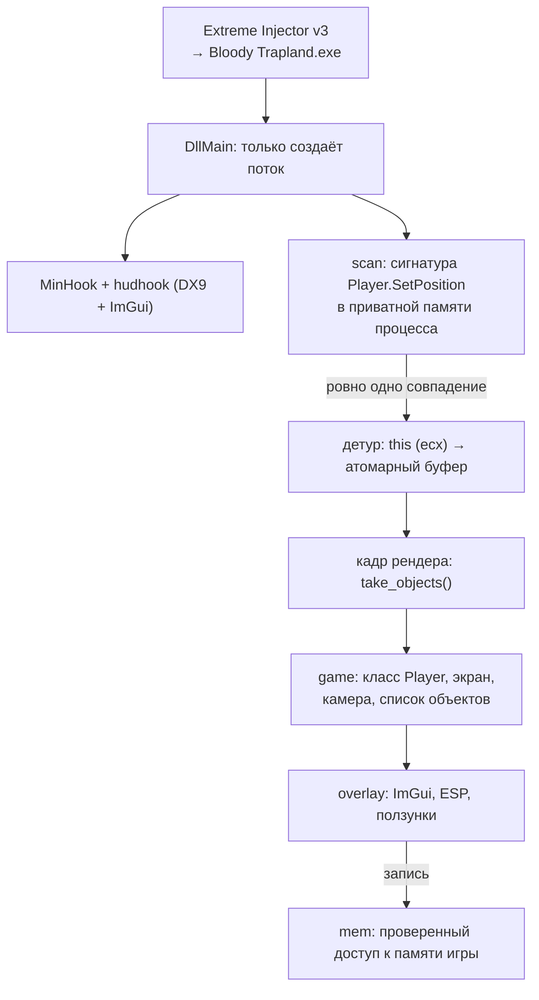

# BTama

**Русский** · [English](README.en.md)

Внутриигровой оверлей для **Bloody Trapland** (XNA / .NET Framework, 32-битный
процесс). Собирается в DLL, инжектируется в процесс игры, перехватывает
`Player.SetPosition`, чтобы получить указатели на живые объекты, и рисует
поверх игры интерфейс ImGui через DirectX 9.

Проект сделан ради разбора внутренностей игры: смещения полей снимались
вручную в Cheat Engine, а интерфейс — способ проверить их, не пересобирая DLL
на каждую догадку. Правка общих объектов в сетевой игре расходится с
состоянием второго игрока, так что по назначению это инструмент одиночной
игры.

## Скриншоты

### Свёрнутое меню: сводка по уровню и ESP


Пока меню не открыто, на экране остаётся только строка состояния — карта,
номер уровня, время уровня и попытки, число смертей — и список игроков с
координатами. ESP при этом работает: рамки ловушек раскрашены по адресу
объекта, локальный игрок обведён зелёным, сетевой — красным.

### Меню игрока


По `HOME` меню закрепляется и появляется панель: `ESP`, `Ловушки`,
`Телепорт`, `DEV`, переключатель `RU`/`EN`. Ниже — строка локального игрока с
кнопкой респавна, галочками бессмертия, бесконечного прыжка и ходьбы в
приседе, а также ползунки скорости, прыжка и гравитации. Справа от каждого
ползунка — кнопка сброса и живое значение из памяти игры.

### Trap Manager


Объекты уровня сгруппированы по классам: тип из `ObjectType`, имя ассета,
количество и общие флаги. Действие применяется ко всей группе — у объектов
одного класса совпадают и поля, и смысл. У `BoomTrap` вдобавок доступны
`Trigger` и `Speed`.

## Возможности

**ESP.** Рамки ловушек и игроков в мировых координатах, переведённых матрицей
камеры игры. Цвет рамки ловушки — устойчивый хеш её адреса, тот же, что у
подложки названия в списке: видно, какая рамка какой строке соответствует.
Подписи (`Labels`) отвечают на вопрос «что это за пустой квадрат» — у
спавнов, финишей и зон нет спрайта, но есть тип.

**Сводка по уровню.** Карта (`MaptoLoad`), номер мира и уровня, время с начала
уровня (`m_GameTimer`), время с последнего спавна (`m_FinishTimer`), смерти,
убийства. Показывается и при свёрнутом меню — ради неё оно в свёрнутом виде и
существует. Поля, которые не прочитались, показываются прочерком, а не нулём.

**Параметры персонажа.** Бессмертие, бесконечный прыжок, ходьба в приседе,
ползунки скорости, высоты прыжка и гравитации, кнопка респавна. Ползунок
действует с первого сдвига и прописывается каждый кадр — иначе игра вернёт
своё при ближайшем респавне. Кнопка сброса возвращает значение, каким оно было
при первой встрече с персонажем.

**Телепорт.** Правой кнопкой мыши мимо окон интерфейса — персонаж
переносится в точку под курсором. Экранные координаты переводятся в мировые
обратной матрицей камеры.

**Trap Manager.** Все объекты экрана, сгруппированные по указателю на таблицу
методов. Флаг `Update` (`Updateable`) показывает состояние первого объекта
группы, а пишется во все; если объекты разошлись, к метке добавляется
звёздочка — клик тогда не переключает флаг, а выравнивает группу.

Числовые параметры классов, чьи смещения сняты:

| Класс | Ползунок | Поле |
|---|---|---|
| `Spinner` | Вращение | `PendelSpeed` (0x9C), радиан в секунду, по умолчанию 6.0 |
| `SawBlade` | Ход | `Movespeed` (0xA4); `RotationSpeed` (0xA0) меняется следом в той же пропорции |
| `Cannon` | Перезарядка | `fireDelayMaxTime` (0xA0), секунды между выстрелами |
| `Tracker` | Прицел | `LockTimeWait` (0xAC) — сколько пушка целится перед выстрелом |
| `RPlatform` | Ход | `Movespeed` (0x98) |
| `Threadmill` | Дорожка | `velocity.X` (0x9C) — что дорожка добавляет к скорости |
| `Fan` | Поток | `FanForce` (0x98) — сила и дальность потока |
| `Trampoline` | Подброс | `BounceSpeed` (0x9C) |
| `BoomTrap` | Speed, Trigger | `Speed` (0xA4), `m_CanTrigger` (0xAC) |

**Режим `DEV`.** Путь к логу, счётчики разбора (объекты от хука, таблица
методов `Player`, адрес экрана, режим игры, камера, число ловушек), сырые
поля объекта за общей частью раскладки (0x90…0x140) и числа рамок ловушек.
Нужен при поиске смещений, в игре только мешает.

**Два языка.** `RU` / `EN` переключаются на месте. Имена полей игры не
переводятся ни в одном: `Bounding`, `Updateable`, `moveSpeed` зовутся так в её
исходниках, и переводить их значило бы обрывать связь с ними.

## Управление

| Клавиша | Действие |
|---|---|
| `HOME` | закрепить или убрать меню |
| `TAB` | показать меню на время удержания |
| `ПКМ` | телепорт в точку под курсором (при включённой галочке) |
| `PAGE DOWN` | снять хуки и выгрузить DLL |

Пока меню закреплено, ввод не доходит до игры; в режиме `TAB` перехватывается
только мышь. Клавиши игнорируются, когда окно игры не активно.

## Как это работает



### Загрузка

`DllMain` не делает почти ничего: под блокировкой загрузчика нельзя вызывать
почти ничего, поэтому вся работа выносится в отдельный поток. Там ставится
обработчик паник (в инжектированной DLL `stderr` никто не читает),
открывается файл лога, инициализируется MinHook и запускается первая попытка
поставить хук. Оверлей поднимается через `hudhook`, который сам перехватывает
`EndScene` DirectX 9.

### Поиск метода

Код игры управляемый: JIT компилирует метод при первом вызове в анонимный
регион, адрес которого меняется от запуска к запуску. Поэтому функция ищется
по байтам своего машинного кода — прологу `Player.SetPosition`:

```
83 C1 0C     add ecx, 0Ch
8B C1        mov eax, ecx
D9 44 24 04  fld [esp+4]
```

Сканируется только приватная память (`MEM_PRIVATE`) — там и только там живут
кодовые кучи CLR; страницы-сторожа и некоммитированные регионы пропускаются.
Собираются **все** совпадения: если сигнатура неоднозначна, хук не ставится
вовсе — перехватить наугад не ту функцию хуже, чем не перехватить ничего.

Отсутствие совпадений — нормальное состояние: пока игрок не вошёл в уровень,
метод не вызывался и JIT его не компилировал. Такая попытка не считается
неудачей и повторяется раз в 3 секунды. Неудачи, которые сами не исправятся
(ошибка MinHook, неоднозначная сигнатура), считаются, и после пяти попытки
прекращаются — вернуть их можно кнопкой в меню.

### Сбор объектов

`SetPosition` вызывается игрой для каждого движущегося объекта каждый кадр, а
`this` лежит в `ecx` (соглашение `thiscall`). Детур написан как
`#[unsafe(naked)]`-функция: сохраняет регистры и флаги, атомарно занимает
слот в буфере на 256 записей (`lock xadd`), кладёт туда `ecx` и прыгает на
трамплин MinHook. Лишние вызовы просто ничего не пишут.

Пишет буфер поток игры, читает — поток рендера, поэтому элементы атомарные.
Каждый кадр `take_objects` забирает накопленное и обнуляет счётчик.

### Разбор объектов

Настоящего имени класса среди полей нет, и взяться ему неоткуда: есть только
указатель на таблицу методов. Класс `Player` поэтому опознаётся
самопроверяющимся признаком — кандидат обязан найти сам себя в списке игроков
своего же `GameplayScreen`. Случайный мусор такую замкнутую ссылку не даст.
Дальше объект считается игроком, если его таблица методов совпала с
опознанной.

Объекты уровня подписаны самой игрой: в `ObjectType` (0x10) лежит строка с
именем класса, в `Name` (0x20) — имя ассета, в `ZoneName` (0x1C) — уровень.
По строке типа выбирается роль, а роль решает, что можно читать за 0x90: у
`SPSpawn` объект заканчивается на 0x98, и чтение прямоугольника по 0xA4
залезло бы в соседний объект кучи — оттуда охотно возвращается правдоподобная
на вид рамка, и на экране появляются пустые квадраты в воздухе. Сведения о
классе кэшируются по указателю на таблицу методов: таблицы живут в
загрузочной куче, которую сборщик мусора не двигает.

### Камера

Мировые координаты переводятся в экранные матрицей камеры игры. XNA хранит
`Matrix` построчно, а от шестнадцати её чисел двумерной игре нужны шесть:
`M11, M12, M21, M22, M41, M42`. Вырожденная матрица отсекается до
употребления — она схлопнула бы весь мир в точку, а обратное преобразование
(телепорт) дало бы бесконечность. Матрица перечитывается каждый кадр: адрес
камеры с прошлого кадра ничего не гарантирует. Если камера не прочиталась,
ESP не рисуется вовсе — рамки в случайных местах хуже их отсутствия.

Положение объекта игра хранит дважды: `m_Bounding` (0x50) в пикселях и
`Position` (0x88) в единицах физического движка. Масштаб между ними выводится
из самих данных и показывается в режиме `DEV`.

### Безопасный доступ к памяти

Игра написана на .NET, а его сборщик мусора уплотняет кучу и **двигает**
объекты: указатель, полученный кадр назад, может уже указывать на мусор.
Поймать нарушение доступа из Rust на MSVC нечем — это SEH-исключение, а не
паника, и `catch_unwind` его не видит. Значит, проверять адрес нужно *до*
обращения: перед каждым доступом он сверяется с картой регионов процесса
(`VirtualQuery`). Ответы кэшируются — managed-объекты живут в считанных
сегментах GC-кучи, поэтому кэш почти всегда попадает; сбрасывается кэш каждые
30 кадров, чтобы освобождённый регион не считался доступным вечно.

### Устойчивость

Паника в обработчике, вызванном из чужого `extern "system"`-хука,
превращается в `abort` и убивает игру. Поэтому `render` обёрнут в
`catch_unwind`: при панике оверлей замолкает, хук снимается, причина уходит в
лог, игра продолжает работать. По той же причине в `Cargo.toml` оставлен
`panic = "unwind"`.

Пересоздание уровня хук не снимает, но объекты после него могут перестать
приходить. Признак потери — исчезнувшие игроки, а не пустой буфер: хук
приносит только то, что двигалось, и стоящий на месте персонаж в него не
попадает. Если игроков нет 8 секунд, а раньше они были, хук заводится заново.

Выгрузка по `PAGE DOWN` снимает хук и восстанавливает исходные байты: иначе в
игре остался бы `jmp` в освобождённую память, и процесс упал бы при первом же
вызове метода. После выгрузки DLL можно пересобрать и инжектировать снова, не
перезапуская игру.

## Сборка

Целевая платформа зафиксирована в [.cargo/config.toml](.cargo/config.toml),
так что достаточно:

```bash
cargo build --release
```

Результат — `target/i686-pc-windows-msvc/release/btama.dll`.

Если 32-битный тулчейн ещё не установлен:

```bash
rustup target add i686-pc-windows-msvc
```

Сборка под x86_64 отсекается `compile_error!`: детур написан на 32-битном
ассемблере, а все смещения предполагают 4-байтовый указатель.

Тесты (разбор сигнатур, поиск по маске, распаковка цвета, проверка рамок,
матрица камеры и прогон самого ассемблерного детура):

```bash
cargo test
```

## Инжект

Использовался **Extreme Injector v3** от master131:
<https://github.com/master131/extremeinjector>

Ни сам инжектор, ни его `settings.xml` в репозиторий не входят и намеренно
исключены в `.gitignore`: это сторонний инструмент, а не часть проекта, и
бинарник вдобавок стабильно ловится антивирусами.

Порядок:

1. собрать DLL (`cargo build --release`);
2. запустить `Extreme Injector v3.exe` от администратора;
3. в списке процессов выбрать `Bloody Trapland.exe`;
4. `Add DLL` → `target\i686-pc-windows-msvc\release\btama.dll`;
5. метод инжекта — обычный `LoadLibrary`; `Stealth Inject`, `Erase PE` и
   `Scramble` не нужны и только мешают;
6. `Inject`.

Сразу после инжекта в меню будет «ожидание»: пока игрок не вошёл в уровень,
`SetPosition` не вызывался и JIT его не скомпилировал. Хук встанет сам через
несколько секунд после загрузки уровня.

## Диагностика

Консоли у инжектированной DLL нет, поэтому лог пишется сразу в два места:

- `OutputDebugStringW` — видно в DebugView или подключённом отладчике;
- `%TEMP%\BTamaCheat.log` — переживает падение игры.

Если `%TEMP%` недоступен, файл заводится рядом с DLL, затем в профиле
пользователя. Точный путь показан в открытом меню — пока хук не встал, и
дальше по галочке `DEV`. Состояние конвейера (хук, экран, число объектов, игроков,
ловушек, камера, масштаб, размер окна) пишется в лог при каждом изменении, а
не каждый кадр.

## Устройство

| Модуль | Ответственность |
|---|---|
| [`src/lib.rs`](src/lib.rs) | точка входа DLL, инициализация, выгрузка |
| [`src/scan.rs`](src/scan.rs) | поиск сигнатуры в исполняемой памяти |
| [`src/hook.rs`](src/hook.rs) | детур `SetPosition`, сбор указателей на объекты |
| [`src/mem.rs`](src/mem.rs) | проверяемый доступ к памяти игры |
| [`src/offsets.rs`](src/offsets.rs) | смещения полей |
| [`src/game.rs`](src/game.rs) | разбор игровых объектов, камера, ловушки |
| [`src/overlay.rs`](src/overlay.rs) | интерфейс и применение читов |
| [`src/text.rs`](src/text.rs) | строки интерфейса на двух языках |
| [`src/font.rs`](src/font.rs) | шрифт интерфейса с кириллицей |
| [`src/log.rs`](src/log.rs) | диагностика |

Каталог `re/` — дампы структур из Cheat Engine, источник всех смещений в
`offsets.rs`. При обновлении игры сверяться нужно с ними. В репозиторий он не
входит.

## Известные ограничения

- **Сигнатура привязана к сборке игры.** Меняется код `SetPosition` —
  меняется и пролог; хук тогда не встанет, и это видно по статусу в меню.
- **Раскладки не всех классов сняты.** У ролей, чьи смещения не разобраны,
  ползунков нет вовсе: молчание честнее, чем ползунок по угаданному адресу.
  Сырые поля за 0x90 можно посмотреть в режиме `DEV` и опознать глазами — у
  многих полей узнаваемые значения по умолчанию.
- **Ловушки без пригодной рамки.** Часть объектов не даёт правдоподобного
  прямоугольника; ESP их не рисует, а число таких объектов уходит в лог.
- **Сетевая игра.** Правка параметров и общих объектов расходится с
  состоянием на стороне второго игрока.

## Релизы

Сборку на GitHub делает [.github/workflows/release.yml](.github/workflows/release.yml):
на `windows-latest` добавляется цель `i686-pc-windows-msvc`, гоняются тесты,
собирается релизная DLL и переименовывается в `btama-v<версия>-x86.dll` —
версия берётся из `Cargo.toml`. Артефакт остаётся в прогоне, а при публикации
релиза ещё и прикладывается к нему.

Запускается воркфлоу двумя способами: при публикации релиза
(`release: published`) и вручную из вкладки Actions (`workflow_dispatch`).
Порядок выпуска версии:

```bash
git tag -a v0.2.1 -m "0.2.1"
```

```bash
git push origin v0.2.1
```

```bash
gh release create v0.2.1 --title "BTama 0.2.1" --generate-notes
```

Собирает именно последняя команда: пуш тега сам по себе воркфлоу не
запускает. Версия в `Cargo.toml` должна совпадать с тегом — имя артефакта
берётся из манифеста, а не из тега.

## Лицензия

[MIT](LICENSE).
